# miniRayTracer
RayTracer with MLX42

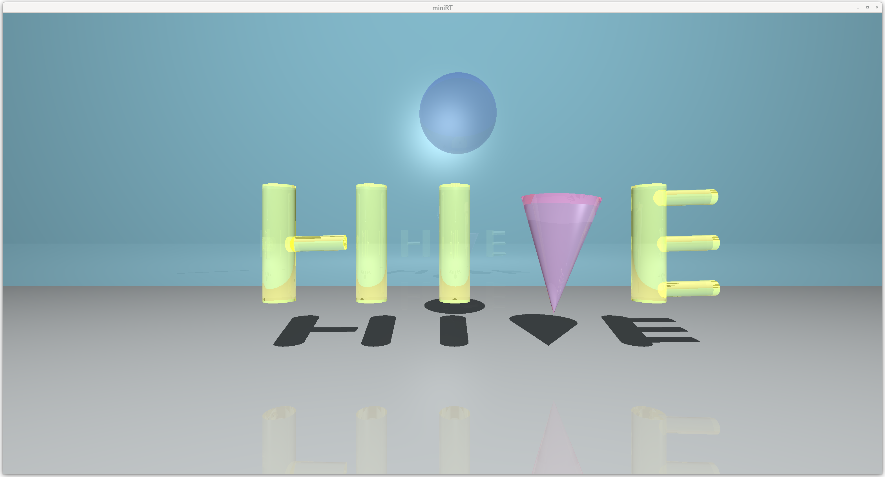

Description
This is a ray tracing project built with the MLX42 graphics library. It simulates 3D scenes using basic shapes, light, camera, and materials to create realistic images with reflection, refraction, shadows, and more.

## Table of Contents
1. [miniRT](#miniRayTracer)
2. [Project Details](#project-details)
3. [Key Features](#key-features)
4. [Getting Started](#getting-started)
5. [Control Key Bindings](#control-key-bindings)
6. [Screenshots](#screenshots)
7. [Project Structure](#project-structure)
8. [Contributors](#contributors)
9. [Challenges](#challenges)

## Project Details
- **Project Name:** miniRT miniRT_bonus
- **Total Time Spent:** 68 days
- **Total Lines of Code:** 4392
- **Total Commits:** 254
- **Programming Language:** C
- **Libraries Used:** MLX42
- **Team Members:** [Rychkov Iurii](https://github.com/RychkovIurii) and [Heidi Enbuska](https://github.com/mochoteimoso)

This project involved building a ray tracing program, which generates 3D scenes based on user input. The base functionality supports rendering spheres, planes, cones, and cylinders, with added bonus features for transparency, refraction, and reflection.

## Key Features
- Ray tracing for 3D rendering
- Support for basic shapes (sphere, plane, cone, cylinder)
- Advanced features including transparency, refraction, and reflection
- Real-time rendering with MLX for graphical output

## Getting Started

### Building the Project
To compile the project, run:
```bash
make
```

To compile the bonus version with transparency, refraction, and reflection:
```bash
make bonus
```

This will generate an executable file:
- `miniRT` for the basic version.
- `miniRT_bonus` for the bonus version.

### Launching the Program
To run the RayTracer:
```bash
./miniRT [scene_file.rt]
```
Replace `[scene_file.rt]` with the path to your .rt scene file.

For the bonus version with reflection, refraction, and transparency:
```bash
./miniRT_bonus scene_file.rt
```

### Clean Up
To clean up object files and the executable:
```bash
make clean
```
To remove all files generated during the build (including executables):
```bash
make fclean
```

### Launch with Valgrind and Suppressions
To run the program with Valgrind and suppressions, use the following command:
```bash
valgrind --leak-check=full --show-leak-kinds=all --suppressions=suppression/miniRT.supp ./miniRT
```

## Control Key Bindings
This document provides an overview of the key bindings used in the code.

- **Escape Key (ESC):** Closes the window.
- **Right Mouse Button:** Selects an object in the scene.
- **Arrow Keys (Up, Down, Left, Right):** Move the camera up and down and rotate along the Y axis.
- **W, S, A, D Keys:** Move the camera forward and backward, left and right.
- **Numerical Keypad Keys (KP 4, 5, 6, 7, 8, 9, 0, 1, =, /):** Translate selected shapes along the X, Y, and Z axes. Rotations. Translate selected shapes.
- **KP Add ( + ) and Subtract ( - ):** Scale the selected shape by 2x or 0.5x (if constraints are met).
- **Right Shift and Control Keys:** Adjust light brightness.
- **Left Shift and Control Keys:** Move the light in the Y direction (up or down).
- **Home and End Keys, Page Down and Delete Keys:** Move the light forward and backward, left and right.
- **Left Shift and Left Control Keys:** Move the light in the Z direction (forward or backward).

## Screenshots
Screenshots of rendered scenes are available in the `pngs/` directory. These illustrate:

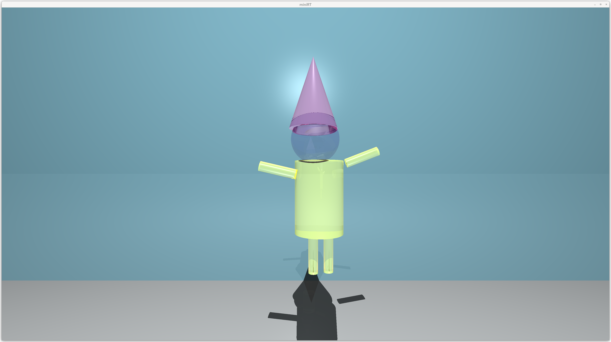
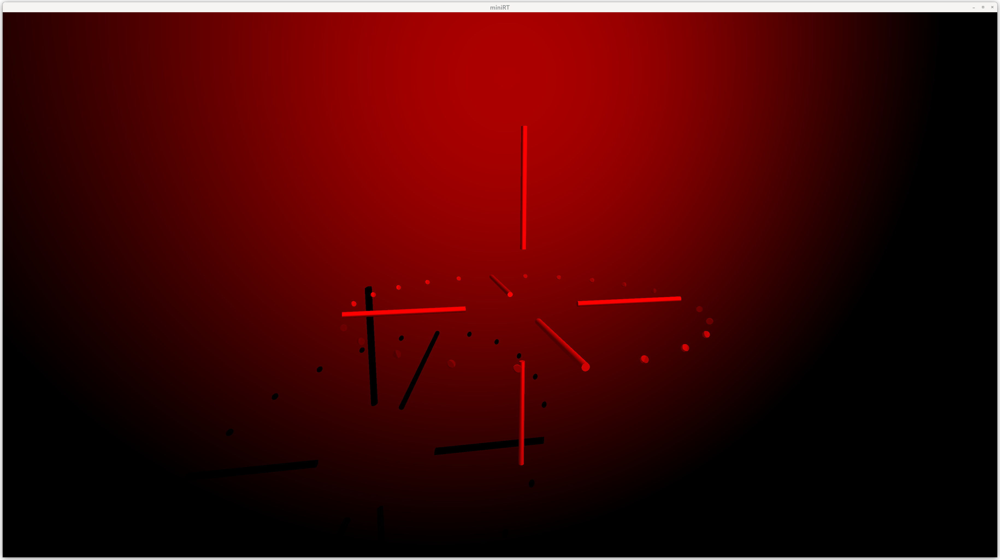
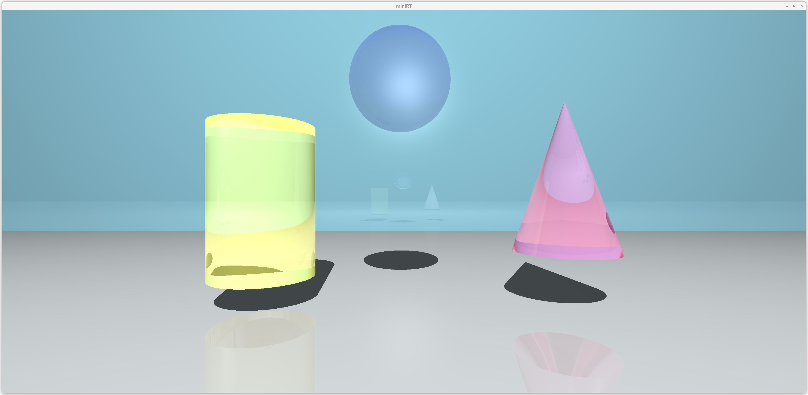
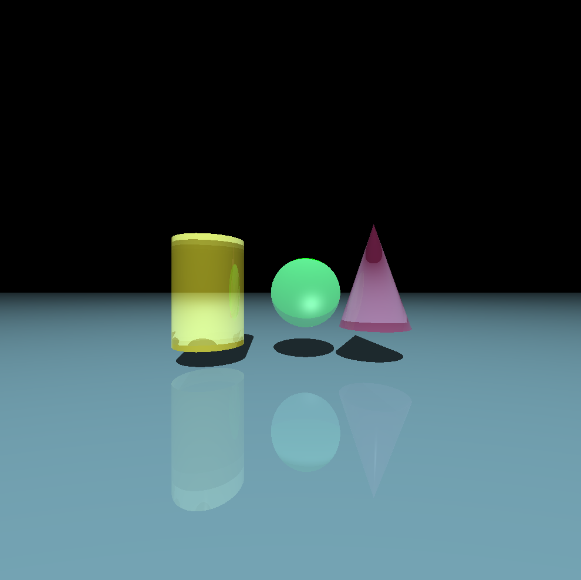
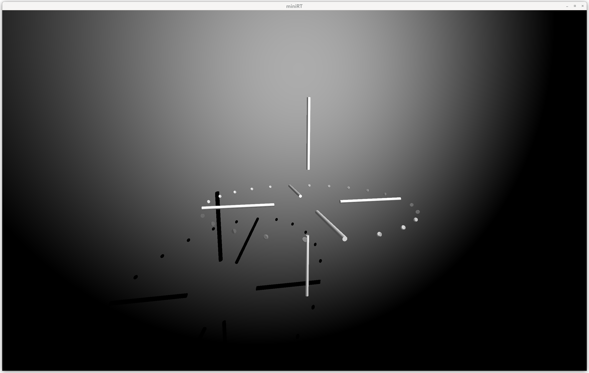
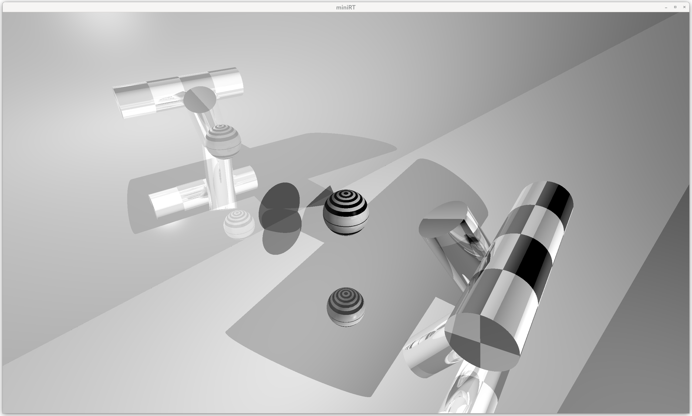
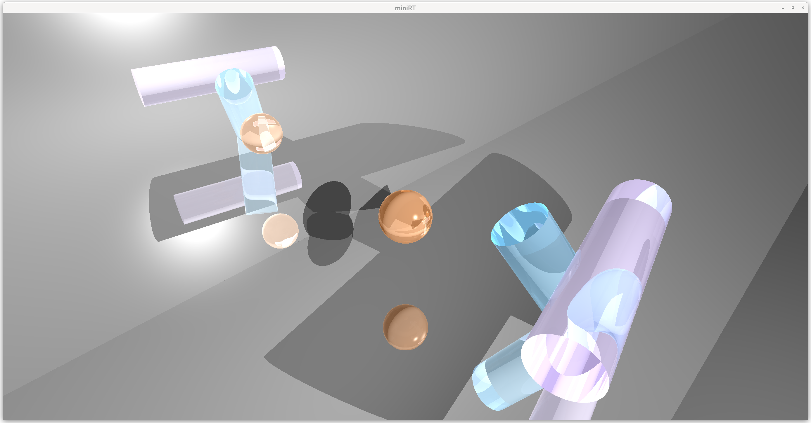
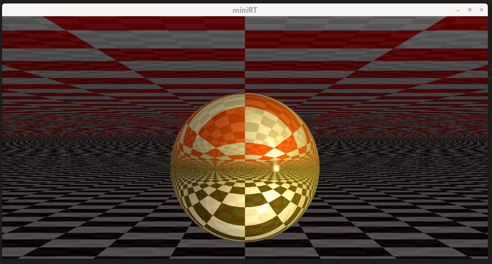
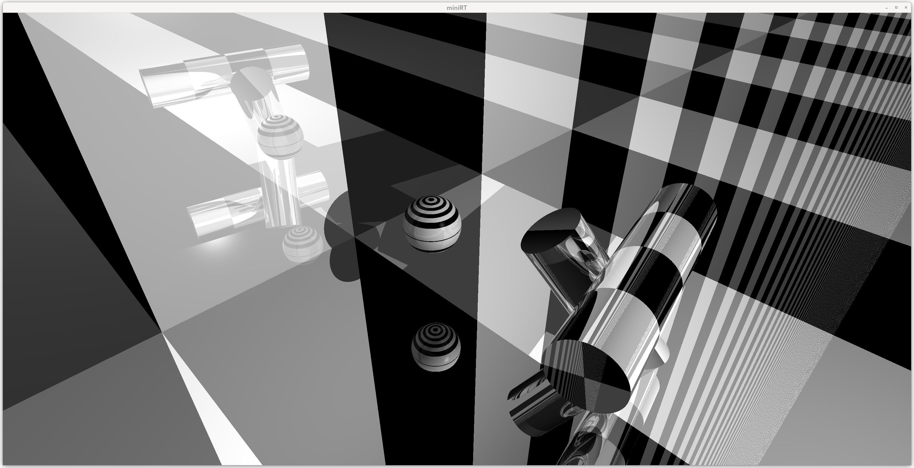
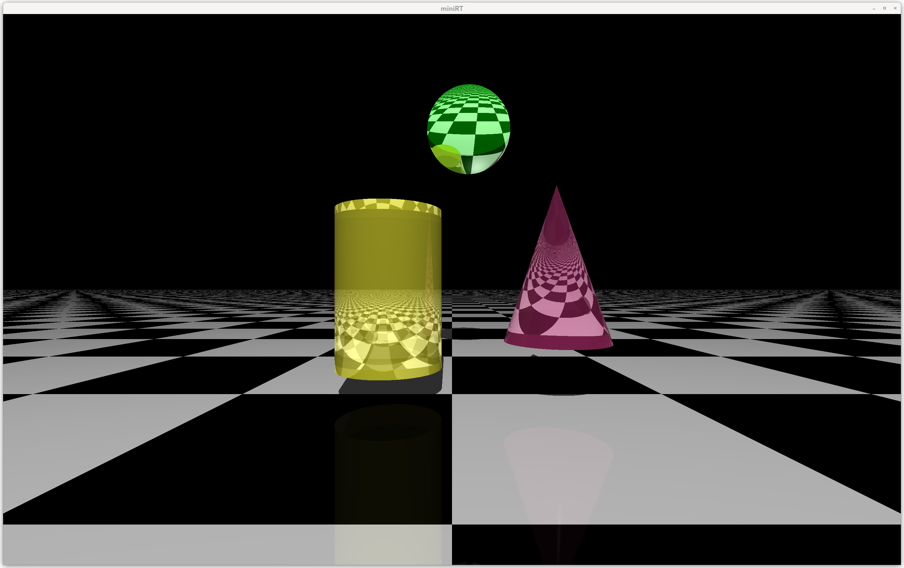
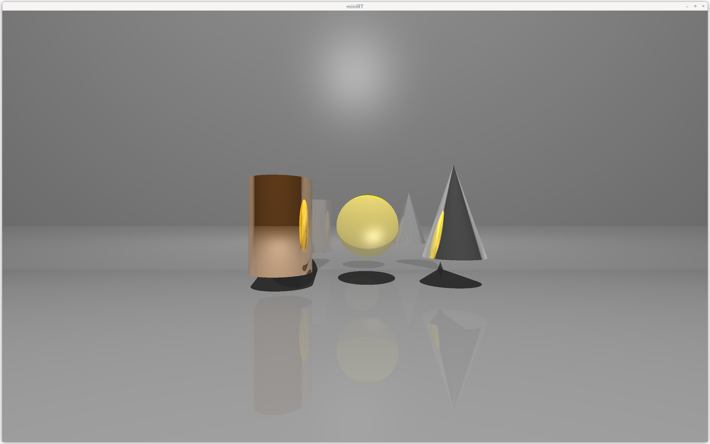

## Project Structure
```
miniRT/
├── Makefile                    # Makefile for building the project
├── README.md                   # Project description and instructions
├── include/                    # Header files
├── info/                       # Info
├── pngs/                       # Rendered scenes
├── src/                        # Source files
│   ├── main.c                  # Main entry point of the program
│   ├── parser/                 # Parsing logic for scene files
│   ├── math/                   # Mathematical operations for vector, matrix, etc.
│   ├── light_and_color/        # Light and material related functions
│   ├── intersection/           # Intersection logic for ray-object interactions
│   ├── keyboard/               # Keyboard input handling
│   ├── utils/                  # Utility functions (string manipulation, file I/O)
│   ├── init.c                  # Initialization functions for scene and camera setup
│   ├── scene.c                 # Scene setup and management
│   ├── camera.c                # Camera setup and rendering logic
│   ├── mlx.c                   # MLX42 library integration for rendering
│   └── free.c                  # Memory management and cleanup
├── obj/                        # Object files directory (created during build)
├── obj_bonus/                  # Object files for bonus features
├── MLX42/                      # MLX42 library (external graphics library)
└── scenes/                     # Folder for scene files
	├── scene1.rt               # Example scene file 1
	└── bonus/                  # Folder with bonus scenes
```

## Contributors

### Rychkov Iurii:
- Rendering Core: Implemented the core rendering system, including ray tracing logic, color calculations, and recursive ray handling for reflection and refraction.
- Transparency and Refraction: Developed the transparency and refraction system to simulate realistic light bending through materials.
- Reflection: Implemented reflection logic to create accurate mirror-like surfaces.
- Color and Light System: Designed and integrated the lighting model, ensuring correct shading, color blending, and realistic light interactions.
- Scene Management: Handled scene construction, including the correct placement and behavior of spheres and planes.
- Math Operations: Worked on implementing essential mathematical operations, such as matrix transformations, vector calculations, and ray-object interactions.
- Optimization: Focused on improving performance by optimizing calculations and memory usage.
- Keyboard Controls: Implemented keyboard interactions to allow dynamic scene control.
- MLX Integration: Connected the rendering system to the MLX42 library for efficient visualization and user interaction.

### Heidi Enbuska:
- Parsing System: Led the development of the parsing logic, ensuring accurate interpretation of input scene descriptions for both mandatory and bonus features.
- Parser for Bonus Scenes: Extended parsing capabilities to support additional scene elements introduced in the bonus part.
- Cone and Cylinder Intersections: Implemented intersection logic for cones and cylinders, ensuring precise ray-object interactions.
- Memory Management: Designed a robust memory management system, preventing leaks and ensuring efficient resource usage.
- Math Operations: Worked on implementing essential mathematical operations, such as matrix transformations, vector calculations, and ray-object interactions.
- Scene Design: Worked on implementing and structuring the scene processing pipeline.
- Scene Management: Handled scene construction, including the correct placement and behavior of cones and cylinders.

## Challenges

1. **Complex Parsing Logic**
   Parsing scene descriptions (lights, shapes, and camera settings) was a significant challenge. The input format had to be processed efficiently while maintaining flexibility for additional features in the bonus part. Special attention was required for error handling, ensuring incorrect input was properly managed without crashes.

2. **Cone and Cylinder Intersections**
   Handling intersections for cones and cylinders required solving complex mathematical equations. Ensuring precise ray-object intersections was particularly difficult due to floating-point precision issues and edge cases where rays would skim along the object’s surface.

3. **Recursive Ray Tracing for Reflection and Refraction**
   Implementing reflection and refraction required recursive ray tracing, where each reflected or refracted ray spawns new rays. Managing recursion depth while maintaining performance was crucial to prevent infinite loops or excessive computation.

4. **Transparency and Light Behavior**
   Simulating transparent materials required tracking multiple light paths as rays passed through different materials, leading to additional complexity in calculations. Handling refraction indices and light bending realistically without distorting performance was a challenge.

5. **MLX42 and Graphics Rendering**
   Connecting the mathematical model to MLX42 required efficient integration between rendering logic and low-level image buffers. Handling graphical updates efficiently ensured smooth rendering.

6. **Optimization**
   Despite using a single-threaded approach, we optimized performance to achieve fast rendering speeds. Key improvements included:
   - Minimized Memory Allocations: Eliminated unnecessary memory allocations to reduce overhead.
   - Avoided Extra Libraries: Kept dependencies minimal for better performance control.
   - Reduced System Calls: Optimized file handling and rendering by minimizing expensive system calls to the kernel.
   - Loop Optimization: Refactored loops to remove redundant computations.
   - Efficient Math Operations: Optimized matrix and vector calculations to improve performance.

As a result, we achieved high-speed rendering without sacrificing quality, even when handling complex scenes.
